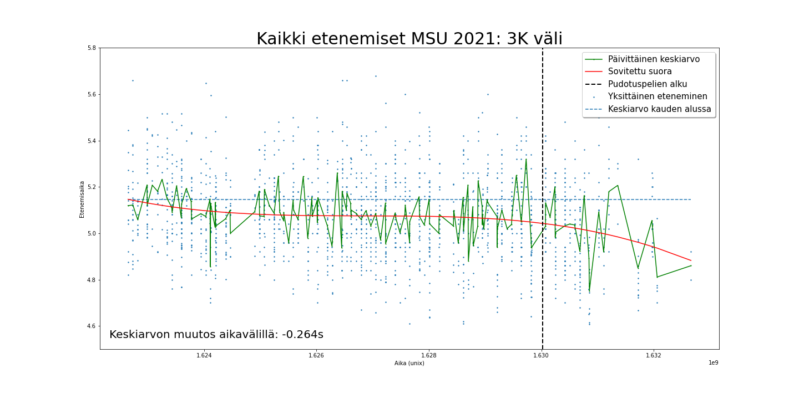
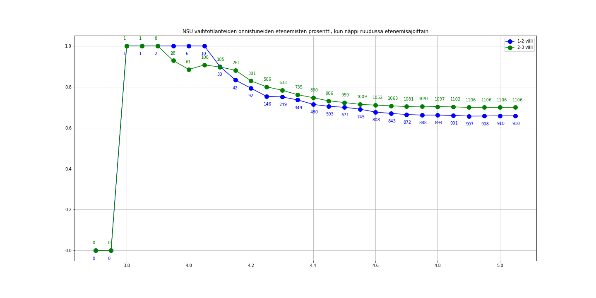

# Jupyter Notebooks project
## Data analysis on season 2021
### Men's and women's finnish baseball major league

This is a Jupyter Notebook project created by Aku Kettunen. In this project I analyzed the season of 2021 of finnish baseball 
with the help of data provided by my company Asoft Oy. Data analysis is done with NumPy, Pandas and Matplotlib.

### Finnish baseball
Finnish baseball is a derivative of baseball created just after the WWI. It is a highly popular sport in Finland and barely played anywhere else. Here's a great clip to get a feel of the fast paced game.

https://www.youtube.com/watch?v=yv2bsKRvVx4

### Some neat graphs
###### Average time ran from third base to home base in the men's league

Red: Fitted average (third order function minimizing the squared error)
Green: Daily average
Vertical black: Start of playoffs
Blue dot: Individual run time

This graph shows that in the men's league

---
###### Slugging percentage when bunted as the function of run time of the runner

In finnish baseball, bunts are quite intricate hits and can be well controlled since the pitch is performed vertically. Bunting is a very common way to try to hit bases in finnish baseball.

Green: From second base to third base
Blue: From first base to second base

This graph shows that with a good enough run, a bunt can be an extremely effective offensive weapon.